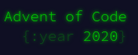

# Advent of Code 2020

<div align="center">
  	
      
</div>

## My solutions to AoC 2020 in javascript !

```
run with node !
```

### folder structure

    .
    ├── day-...                 # days of code folders !
    ├── LICENSE                 # meme
    └── README.md               # this readme
